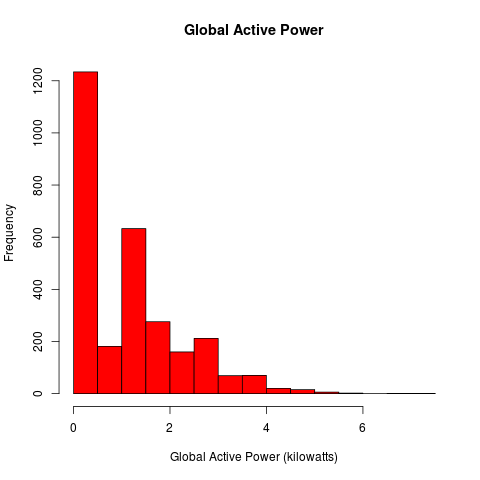
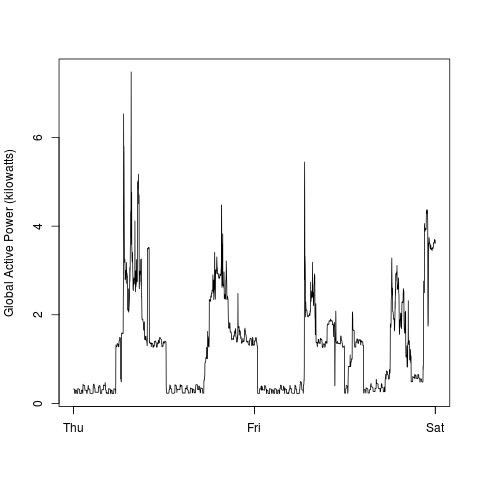
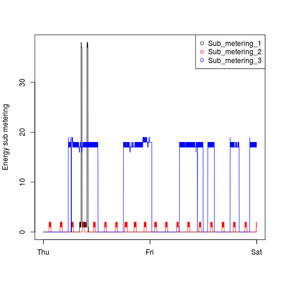
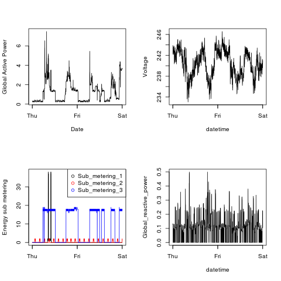

## File Descriptions

The four plot_.R files implement to code to produce the requested charts. These four functions assume a clean data.frame named power.consf in the "global environment". The code for downloading and cleaning the data is in the file importdata.R.

## Execution
Run the following commands in R to produce the png files in the current directory:

* source('importdata.R')
* source('plot1.R')
* source('plot2.R')
* source('plot3.R')
* source('plot4.R')

## Output of png Files
### Plot 1
 

### Plot 2
 

### Plot 3
 

### Plot 4
 
